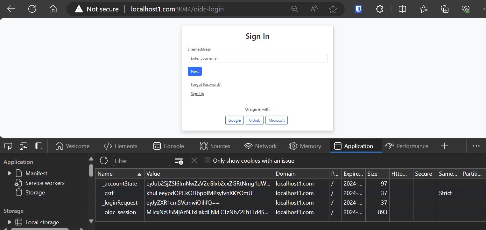
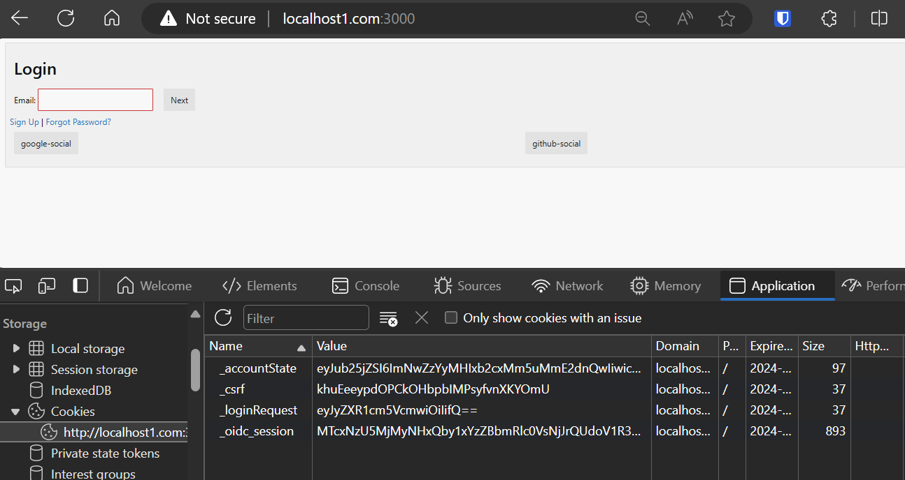

# Getting Started with Create React App

https://codevoweb.com/react-material-ui-and-react-hook-form-html-forms/
https://handsonreact.com/docs/labs/ts/RunningYourProject

cors workaround for develpment.

add

127.0.0.1 localhost1.com
to host file on windows

## Setup Development Environment

This is a workaround because the identity server uses cookies to store state.  The cookies are NOT shared accros domains and localhost is NOT a domain.  i.e. localhost:9044 is not the same thing as localhost:3000.  Its special.

We will have a local domain call ```localhost1.com```. 

1. Add the following to your hosts file.  On windows this is located at ```C:\Windows\System32\drivers\etc\hosts```

```txt
127.0.0.1 localhost1.com
```

2. Lets run our identity server on port 9044.  

The app has been configured to be known as ```localhost1.com```.  The [config file](../cmd/server/config/rage.json) where the ```${DOMAIN}``` is set to ```localhost1.com``` in our [.vscode launch.json](../.vscode/launch.json#15) file.

```json
"DOMAIN":"localhost1.com:9044"      
```

Run the go ```server``` app using vscode debug.  
 
Browse to [account home](http://localhost1.com:9044) pages and click login.  This will start off our OIDC flow and drop the state cookies.  

3. Lets run our react app on port 3000 or 3001.

```http://localhost1.com:3000/``` is the react app.  


When you make fetch calls from the react app they will now use the same cookies and work.

```typescript
    const handleSubmit = async (event: React.FormEvent) => {
        event.preventDefault();
        let csrf = myCommon.getCSRF();
        console.log(csrf);
        // Fetch call to validate the email
        const response = await fetch("http://localhost1.com:9044/api/login-phase-one", {
          method: "POST",
          credentials: 'include', 
          headers: {
            Accept: "application/json",
            "Content-Type": "application/json",
            "X-Csrf-Token":csrf,

          },
          body: JSON.stringify({ 
            email: email,
             }), // send the email as part of the request body
        });
      
        if (response.ok) {
          const data = await response.json();
          if (data.isValid) {
            setRedirectToPassword(true);
          } else {
            // Handle invalid email
          }
        } else {
          // Handle error
        }
      };
```

this example is what happens when the users adds their email and we need to make a call to the backend to find out what to do next.  The response can be a not found, redirect to an external SSO, or redirect to the password page.  Not found means ask the user to do a signup or pick an email that is registered.

This project was bootstrapped with [Create React App](https://github.com/facebook/create-react-app).

## Available Scripts

In the project directory, you can run:

### `npm start`

Runs the app in the development mode.\
Open [http://localhost:3000](http://localhost:3000) to view it in the browser.

The page will reload if you make edits.\
You will also see any lint errors in the console.

### `npm test`

Launches the test runner in the interactive watch mode.\
See the section about [running tests](https://facebook.github.io/create-react-app/docs/running-tests) for more information.

### `npm run build`

Builds the app for production to the `build` folder.\
It correctly bundles React in production mode and optimizes the build for the best performance.

The build is minified and the filenames include the hashes.\
Your app is ready to be deployed!

See the section about [deployment](https://facebook.github.io/create-react-app/docs/deployment) for more information.

### `npm run eject`

**Note: this is a one-way operation. Once you `eject`, you can’t go back!**

If you aren’t satisfied with the build tool and configuration choices, you can `eject` at any time. This command will remove the single build dependency from your project.

Instead, it will copy all the configuration files and the transitive dependencies (webpack, Babel, ESLint, etc) right into your project so you have full control over them. All of the commands except `eject` will still work, but they will point to the copied scripts so you can tweak them. At this point you’re on your own.

You don’t have to ever use `eject`. The curated feature set is suitable for small and middle deployments, and you shouldn’t feel obligated to use this feature. However we understand that this tool wouldn’t be useful if you couldn’t customize it when you are ready for it.

## Learn More

You can learn more in the [Create React App documentation](https://facebook.github.io/create-react-app/docs/getting-started).

To learn React, check out the [React documentation](https://reactjs.org/).
